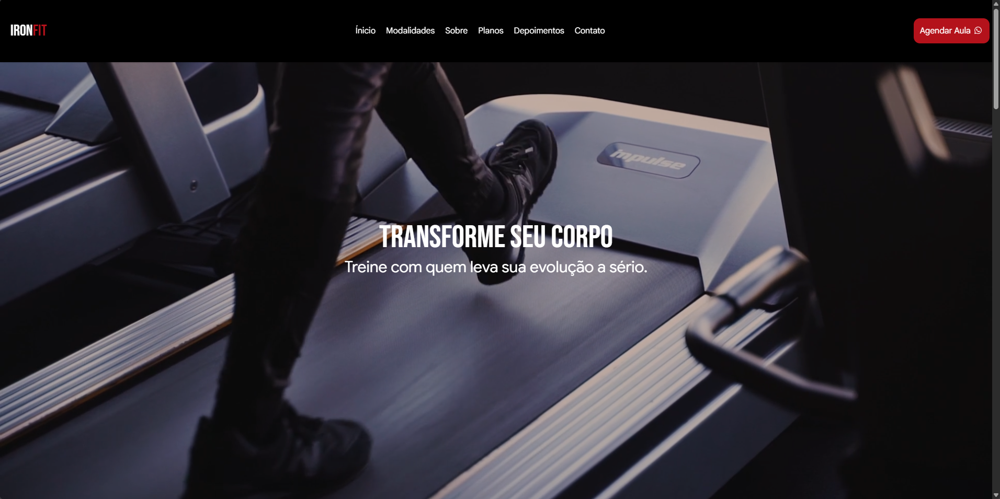

# 🏋️ IronFIT — Landing Page

Landing page institucional para academia fictícia, desenvolvida como projeto de portfólio voltado ao mercado freelancer.

## 🔗 Demo

[Ver projeto ao vivo](https://github.com/joaogabriel7845/IronFIT) <!-- substitua pelo link do Vercel -->

## 📸 Preview



## 🚀 Tecnologias

- [React](https://react.dev/)
- [Vite](https://vitejs.dev/)
- [Tailwind CSS v4](https://tailwindcss.com/)
- [Framer Motion](https://www.framer.com/motion/)
- [Font Awesome](https://fontawesome.com/)
- [NumberFlow](https://number-flow.barvian.me/)

## 📋 Seções

- **Header** — Navegação com menu responsivo e drawer mobile animado
- **Hero** — Vídeo de fundo com título e chamada para ação
- **Stats** — Estatísticas animadas com NumberFlow + IntersectionObserver
- **Modalidades** — Cards de Musculação, Crossfit, Spinning e Luta
- **Sobre** — História da academia + carousel duplo de imagens
- **Planos** — 3 planos (Basic, Pro, Premium) com destaque e botão WhatsApp
- **Depoimentos** — 3 cards com hover animado
- **FAQ** — Accordion com AnimatePresence
- **Contato** — Formulário com validação + informações da academia
- **Footer** — Endereço, redes sociais e horários

## ⚙️ Como rodar localmente

```bash
# Clone o repositório
git clone https://github.com/joaogabriel7845/IronFIT

# Instale as dependências
npm install

# Rode o servidor de desenvolvimento
npm run dev
```

## 💡 Aprendizados

- Carousel infinito com CSS puro (`animation` + `translateX`)
- Animações de entrada com Framer Motion (`whileInView`)
- Contador animado com IntersectionObserver
- Validação de formulário com estado React
- Layout responsivo com Tailwind v4
- Menu drawer mobile com animação

## 👨‍💻 Autor

**João Gabriel** — [GitHub](https://github.com/joaogabriel7845)
